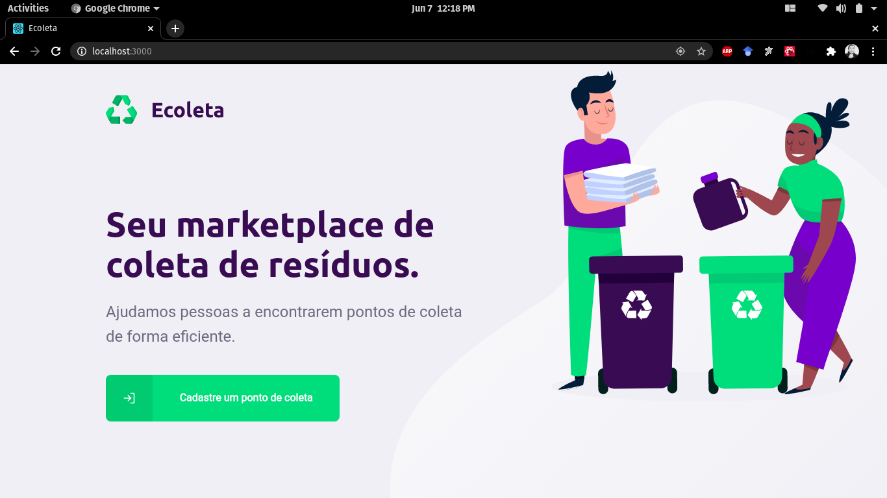
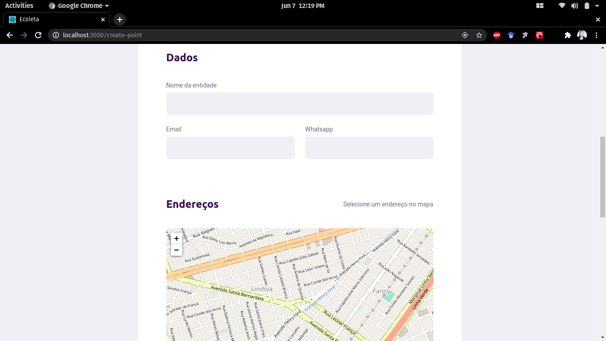

<h1 align="center">Ecoleta</h1>
<h3 align="center">Seja consciente, ajude o planeta!</h3>

<p align="center">
    <a href="https://rocketseat.com.br">
        
    </a>
</p>

###Sumário

- [Sobre o Ecoleta](#sobre)
- [Técnologias](#tecnologias)
- [Como executar](#como-executar)
- [Visão geral (Web)](#web)
- [Visão geral (Mobile)](#mobile)

<a id="sobre"></a>
### :earth_americas: Sobre o Ecoleta
O <strong>Ecoleta</strong> é uma aplicação desenvolvida para a web e mobile, tem como foco ajudar usuários a encontrarem e criarem pontos de coleta de lixo.
O projeto foi desenvolvido durante a Next Level Week da <a href="https://rocketseat.com.br/">Rocketseat</a>.

<a id="tecnologias"></a>
### :robot: Técnologias</h3>

Durante o projeto foram usadas várias técnologias:

- [TypeScript](https://www.typescriptlang.org/)
- [Node.js](https://nodejs.org/en/)
- [ReactJS](https://reactjs.org/)
- [React Native](https://reactnative.dev/)

<a id="como-executar"></a>
### :question: Como executar
- ###**Requisitos**
    - Ter o [Node.js](https://nodejs.org/en/)
    - Ter um gerenciador de pacotes [NPM](https://www.npmjs.com/) ou [Yarn](https://yarnpkg.com/)
    - Ter o [Expo](https://expo.io/) (instalar de forma global)

- ###Faça um clone
```sh
  $ git clone https://github.com/vitorserrano/ecoleta.git
```

- ### Execute os comandos (de preferência na ordem mostrada) 

```sh
  # Instale as dependências do package.json
  $ npm install

  ## Crie o seu banco de dados
  $ cd server
  $ npm run knex:migrate
  $ npm run knex:seed

  # Inicie o server
  $ npm run dev

  # Inicie a aplicação web
  $ cd web
  $ npm start

  # Inicie o app
  $ cd mobile
  $ npm start
```

### :computer: Web

<h1 align="center">
    
</h1>

<h1 align="center">
    
</h1>

### :iphone: Mobile

<h1 align="center">
    
</h1>

<h1 align="center">
    
</h1>
